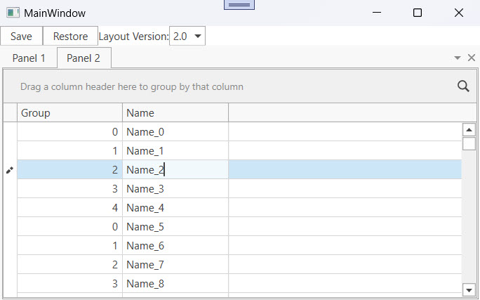

<!-- default badges list -->

[](https://supportcenter.devexpress.com/ticket/details/T163763)
[](https://docs.devexpress.com/GeneralInformation/403183)
[](#does-this-example-address-your-development-requirementsobjectives)
<!-- default badges end -->

# WPF Dock Layout Manager – Upgrade the Application Layout Between Versions

When you change the application layout (for example, adding new panels, enabling MDI mode, or rearranging groups) previously saved layouts may become outdated or incompatible. This example saves and restores layouts while supporting structural changes across different versions of the application.

Use this example to:
* Detect the version of the layout being restored.
* Apply upgrade logic to adjust the layout for both [`DockLayoutManager`](https://docs.devexpress.com/WPF/DevExpress.Xpf.Docking.DockLayoutManager) and nested controls like [`GridControl`](https://docs.devexpress.com/WPF/DevExpress.Xpf.Grid.GridCell.GridControl).
* Preserve backward compatibility while keeping layouts aligned with the current application structure.



## Implementation Details

### Version Management

The [`DXSerializer.LayoutVersion`](https://docs.devexpress.com/WPF/DevExpress.Xpf.Core.Serialization.DXSerializer.LayoutVersion) property specifies the version of the current layout. In this example, the [`ComboBoxEdit`](https://docs.devexpress.com/WPF/DevExpress.Xpf.Editors.ComboBoxEdit) control allows the user to change the current layout version:

```xaml
<dxe:ComboBoxEdit EditValue="{Binding ElementName=dockLayoutManager, Path=(dx:DXSerializer.LayoutVersion)}">
    <sys:String>1.0</sys:String>
    <sys:String>2.0</sys:String>
</dxe:ComboBoxEdit>
```

### Save and Restore Layouts

Use the [`WorkspaceManager`](https://docs.devexpress.com/WPF/DevExpress.Xpf.Core.WorkspaceManager) component to save the application layout to an XML file and restore it when needed:

```csharp
manager.CaptureWorkspace("TestWorkspace");
manager.SaveWorkspace("TestWorkspace", layoutPath);
manager.LoadWorkspace("TestWorkspace", layoutPath);
manager.ApplyWorkspace("TestWorkspace");
```

### Upgrade Logic

When a layout from an older version is restored, the [`GridControl`](https://docs.devexpress.com/WPF/DevExpress.Xpf.Grid.GridCell.GridControl) and `DockLayoutManager` raise the [`DXSerializer.LayoutUpgrade`](https://docs.devexpress.com/WPF/DevExpress.Xpf.Core.Serialization.DXSerializer.LayoutUpgrade) event to apply custom upgrade logic and adapt the layout to the current version of the application.

* For the [`DockLayoutManager`](https://docs.devexpress.com/WPF/DevExpress.Xpf.Docking.DockLayoutManager), the handler switches the MDI style if the layout version is `"1.0"`:

```csharp
void OnDockLayoutManagerLayoutUpgrade(object sender, LayoutUpgradeEventArgs e) {
    if (e.RestoredVersion == "1.0") {
        documentGroup1.MDIStyle = MDIStyle.MDI;
    }
}
```

* For the [`GridControl`](https://docs.devexpress.com/WPF/DevExpress.Xpf.Grid.GridCell.GridControl), the handler applies grouping based on the restored version:

```csharp
void OnGridControlLayoutUpgrade(object sender, LayoutUpgradeEventArgs e) {
    if (e.RestoredVersion == "1.0") {
        ((GridControl)sender).GroupBy("Group");
    }
}
```

This logic ensures that older layouts can be upgraded to match the latest application structure and behavior.

## Files to Review

* [MainWindow.xaml](./CS/MainWindow.xaml) (VB: [MainWindow.xaml](./VB/MainWindow.xaml))
* [MainWindow.xaml.cs](./CS/MainWindow.xaml.cs) (VB: [MainWindow.xaml.vb](./VB/MainWindow.xaml.vb))

## Documentation

* [DockLayoutManager](https://docs.devexpress.com/WPF/DevExpress.Xpf.Docking.DockLayoutManager)
* [Layout Management](https://docs.devexpress.com/WPF/115547/controls-and-libraries/layout-management)
* [DXSerializer.LayoutVersion](https://docs.devexpress.com/WPF/DevExpress.Xpf.Core.Serialization.DXSerializer.LayoutVersion)
* [DXSerializer.LayoutUpgradeEvent](https://docs.devexpress.com/WPF/DevExpress.Xpf.Core.Serialization.DXSerializer.LayoutUpgradeEvent)
* [Save/Restore Control Layout](https://docs.devexpress.com/WPF/7391/common-concepts/saving-and-restoring-layouts)

## More Examples

* [WPF Dock Layout Manager – Move a Layout Item in Code](https://github.com/DevExpress-Examples/wpf-docklayoutmanager-move-a-layout-item-in-code)
* [WPF Dock Layout Manager – Serialize Custom Panels and Their Properties](https://github.com/DevExpress-Examples/wpf-dock-layout-manager-serialize-custom-panels-and-their-properties)
* [WPF Dock Layout Manager – Serialize DockLayoutManager When You Use the TabbedDocumentUIService](https://github.com/DevExpress-Examples/wpf-docklayoutmanager-serialize-docklayoutmanager-when-tabbeddocumentuiservice-is-used)
* [WPF Dock Layout Manager – Populate a LayoutGroup with ViewModel Collection](https://github.com/DevExpress-Examples/wpf-docklayoutmanager-display-viewmodels-collection-in-layoutgroup)
* [WPF Dock Layout Manager – Bind the View Model Collection with LayoutAdapters](https://github.com/DevExpress-Examples/wpf-docklayoutmanager-bind-view-model-collection-with-layoutadapters)

<!-- feedback -->
## Does this example address your development requirements/objectives?

[](https://www.devexpress.com/support/examples/survey.xml?utm_source=github&utm_campaign=wpf-dock-layout-manager-upgrade-layouts-between-versions&~~~was_helpful=yes) [](https://www.devexpress.com/support/examples/survey.xml?utm_source=github&utm_campaign=wpf-dock-layout-manager-upgrade-layouts-between-versions&~~~was_helpful=no)

(you will be redirected to DevExpress.com to submit your response)
<!-- feedback end -->
